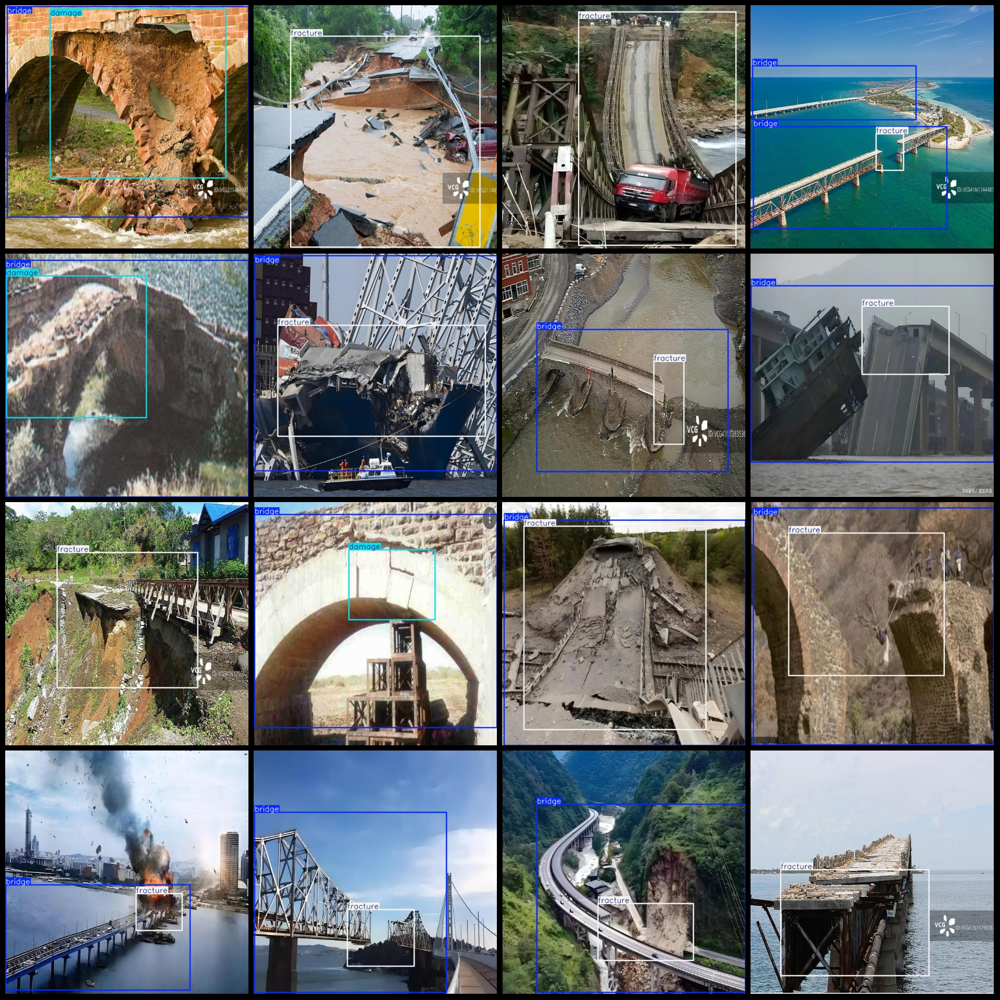
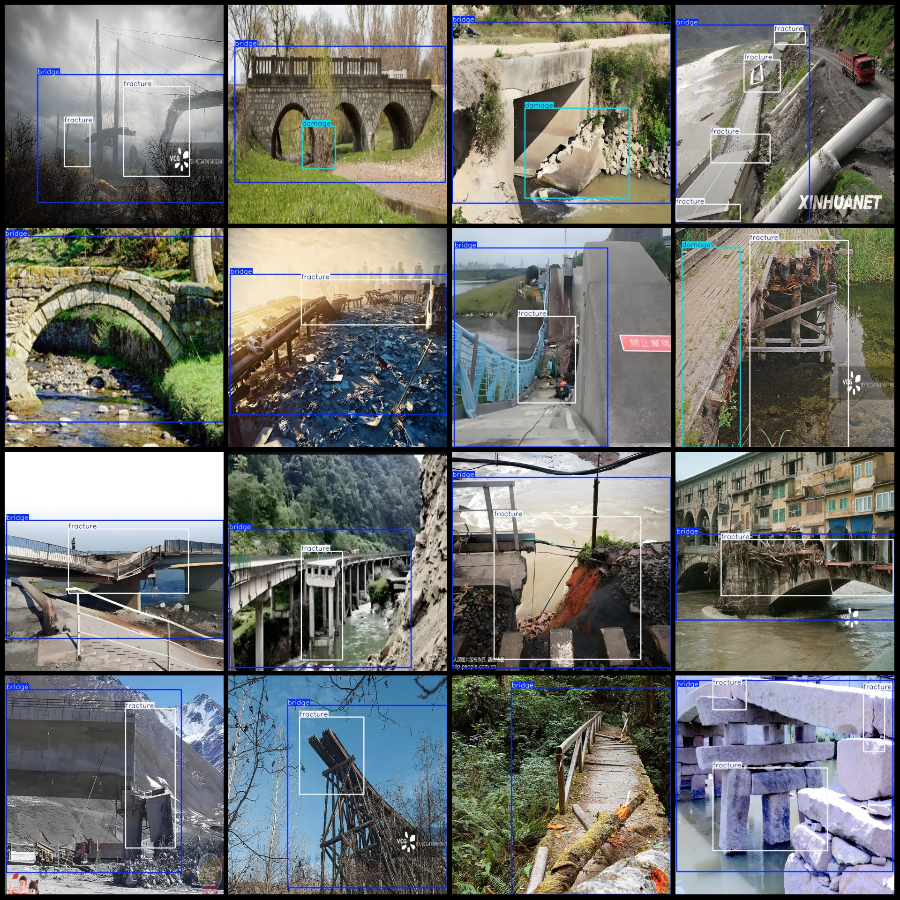

# Bridge Damage and Fracture Detection Dataset in Pascal VOC+YOLO Format with 463 Images (3 Classes)

The dataset format includes: Pascal VOC format + YOLO format (without the split path in the txt file, only containing jpg images along with their corresponding VOC format xml files and YOLO format 
txt files).

Number of images (jpg file count): 463
Number of labeled files (xml file count): 463
Number of labeled files (txt file count): 463
Number of labeled categories: 3
Labeled category names (note that the order in the YOLO format does not correspond to this, but refer to the "labels" folder's "classes.txt" for reference): ["bridge", "damage", "fracture"]

Each category has a number of bounding boxes:
- bridge (bridge) bounding boxes = 385
- damage (damage) bounding boxes = 133
- fracture (fracture) bounding boxes = 443
Total bounding box count: 961
Each category occupies a number of images:
- bridge (bridge) occupies images = 381
- damage (damage) occupies images = 106
- fracture (fracture) occupies images = 327

Image resolution: 640x640

Annotation tool used: labelImg
Annotation rules: drawing bounding boxes for each category

Important notice: The dataset does not have separate training, validation, or test sets; you need to divide them yourself.
Special statement: This dataset does not guarantee the accuracy of the trained models or weight files.

Image preview:

Annotated example:

## Images

Here is a pay link on Stripe ( https://buy.stripe.com/3cs8yP7sY87d0vu9AB ). Please contact me lonlonago@foxmail.com after funding $89, and I will send you a complete data files , thank you!

